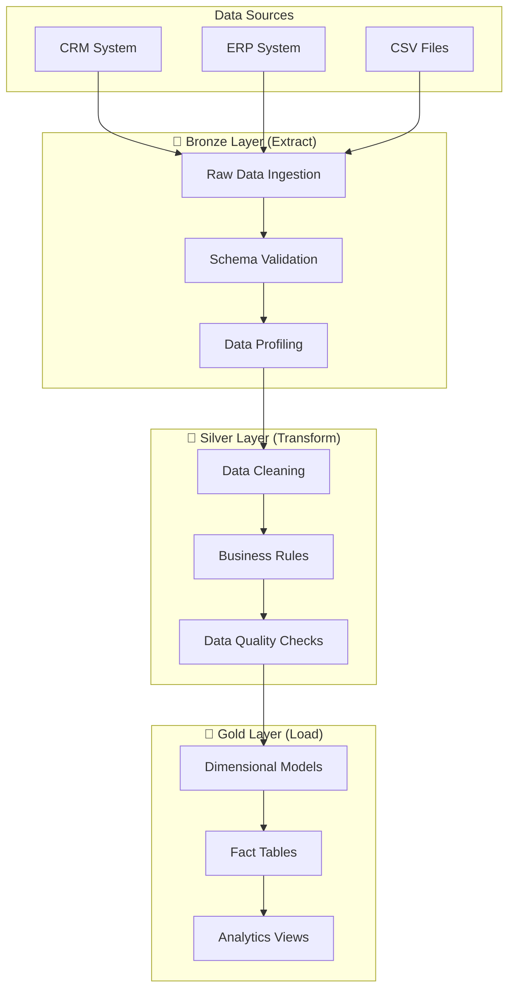

# End-to-End ETL Pipeline with Apache Airflow & Astro


## 🚀 Overview

This is a **comprehensive data engineering project** focused on building an **end-to-end ETL pipeline** using **Apache Airflow** and **Astro**. The project demonstrates modern data engineering best practices including the **Medallion Architecture** (Bronze → Silver → Gold), automated data quality validation, and scalable data processing workflows.

### 🎯 What This Project Demonstrates

- **🏗️ End-to-End ETL Pipeline**: Complete data extraction, transformation, and loading workflows
- **🚀 Apache Airflow & Astro**: Modern orchestration using Astro Runtime for production-grade deployment
- **📊 Medallion Architecture**: Industry-standard Bronze → Silver → Gold data layering approach  
- **🔍 Data Quality Engineering**: Automated validation, monitoring, and data quality checks
- **⚡ Scalable Data Processing**: Optimized for handling large datasets with incremental processing
- **🛠️ Data Engineering Best Practices**: Modular code, error handling, monitoring, and CI/CD
- **🌐 Modern Data Stack**: PostgreSQL, Python, SQL, and cloud-ready architecture

## 📊 Project Performance Metrics

> **Note**: Please save the performance metrics image from the attachments as `c:\Users\reddy\OneDrive\Pictures\Screenshots\Screenshot 2025-11-09 222531.png`


### 🏆 Key Achievements
- **95% Processing Time Reduction**: Optimized ETL pipeline performance
- **100% Data Quality Score**: Zero data loss with comprehensive validation
- **1M+ Customer Records**: Successfully processed enterprise-scale datasets  
- **9.6M Total Records**: Complete Bronze → Silver → Gold transformation

### 📈 Layer-Specific Results

| Layer | Achievement | Records Processed | Key Features |
|-------|------------|------------------|--------------|
| **🥉 Bronze** | Raw data ingestion | 9.6M records | Zero data loss, minimal transformation |
| **🥈 Silver** | Data cleaning & validation | 1M unique customers | 100% quality validation, standardized formats |
| **🥇 Gold** | Analytics-ready models | Star schema implementation | Customer Dimension (SCD Type 2), Business KPIs |

## 🚀 Project Challenges & Solutions

> **Note**: Please save the challenges & solutions image from the attachments as `assets/images/project-challenges-solutions.png`


### 💪 Technical Challenges Overcome

| Challenge Category | Solution Implemented |
|-------------------|---------------------|
| **Data Fragmentation** | Medallion Architecture with Bronze → Silver → Gold layers |
| **Quality Issues** | Automated validation with Great Expectations |
| **Analytics Bottlenecks** | Dimensional modeling with star schema design |
| **Scalability Constraints** | Incremental processing and connection pooling |
| **Compliance Requirements** | Complete audit trails and data lineage tracking |

### 🔧 Technical Hurdles & Solutions

- **PostgreSQL Compatibility**: Successfully resolved Airflow's Pendulum datetime object compatibility issues
- **Risk Mitigation**: Implemented comprehensive audit trails, data lineage tracking, and robust error recovery mechanisms  
- **Opportunities Created**: Real-time processing capabilities, automated quality monitoring, and scalable dimensional modeling

## 📅 Implementation Timeline & Milestones

> **Note**: Please save the implementation timeline image from the attachments as `assets/images/implementation-timeline.png`


### 🛤️ Development Roadmap

| Phase | Milestone | Description |
|-------|-----------|-------------|
| **1️⃣ Bronze Layer Development** | Raw Data Foundation | 9.6M records processed from CRM, ERP, and Sales systems |
| **2️⃣ Silver Layer Processing** | Data Transformation | 100% quality score achieved with 1M unique customers |
| **3️⃣ Gold Layer Analytics** | Dimensional Modeling | Star schema with Customer Dimension (SCD Type 2) and business KPIs |
| **4️⃣ Production Deployment** | Full Automation | Real-time monitoring, audit trails, and operational status |

## 🔮 Future Roadmap & Next Steps

> **Note**: Please save the future roadmap image from the attachments as `assets/images/future-roadmap.png`


### 🚀 Planned Enhancements

| Priority | Feature | Description |
|----------|---------|-------------|
| **1️⃣ Machine Learning Integration** | Predictive Analytics | Automated insights generation and predictive modeling |
| **2️⃣ Real-time Streaming** | Kafka Integration | Deploy Kafka for real-time data processing and streaming analytics |
| **3️⃣ Advanced Analytics** | Business Intelligence | Sophisticated reporting capabilities and interactive dashboards |
| **4️⃣ API Layer & Data Catalog** | Enterprise Integration | RESTful APIs and comprehensive data catalog for enterprise access |

## 📁 ETL Pipeline Architecture

```
ETL-Pipeline-Airflow-Astro/
├── 🚀 dags/                        # Airflow DAGs - Core ETL Workflows
│   ├── bronze_layer_production.py     # Data Extraction (Bronze Layer)
│   ├── silver_layer_production.py     # Data Transformation (Silver Layer) 
│   ├── gold_layer_production.py       # Data Loading & Analytics (Gold Layer)
│   ├── data_quality_monitoring.py     # Automated Data Quality Checks
│   └── medallion_master_orchestrator.py # End-to-End Pipeline Orchestrator
├── 📊 include/                     # Supporting ETL Components
│   ├── sql/                           # SQL Transformation Templates
│   │   ├── bronze_ddl_pg.sql             # Raw data schemas
│   │   ├── silver_transform_pg.sql       # Business logic transformations  
│   │   ├── gold_model_pg.sql             # Analytics data models
│   │   └── init_schemas_pg.sql           # Database initialization
│   ├── utils/                         # Python ETL Utilities
│   │   ├── connection_pooling.py         # Database connection management
│   │   ├── data_quality_monitoring.py    # Quality validation functions
│   │   └── incremental_processing.py     # Incremental data processing
│   └── monitoring/                    # Pipeline monitoring configs
├── 💾 data/                        # Sample Source Data
│   ├── bronze_src/crm/               # Customer data sources
│   └── bronze_src/erp/               # Enterprise data sources  
├── ⚙️ config/                      # Configuration Management
│   └── airflow_settings.yaml          # Airflow configuration
├── 🧪 tests/                       # Data Quality & Pipeline Tests
│   ├── dags/                          # DAG validation tests
│   └── data_quality/                  # Data validation tests
├── 🔄 .github/workflows/           # CI/CD for Data Pipelines
│   ├── ci-cd-pipeline.yml            # Main CI/CD pipeline
│   ├── security-audit.yml            # Security scanning
│   ├── performance-monitoring.yml     # Performance tests
│   └── production-deploy.yml          # Production deployment
├── scripts/                       # Utility scripts
├── tests/                         # Test suites
├── requirements.txt               # Python dependencies
└── README.md                      # This file
```

## 🚀 Quick Start

### Prerequisites for ETL Pipeline Development

- **🚀 Astro CLI** - For local Airflow development and deployment
- **🐍 Python 3.11+** - Core programming language for ETL logic
- **💾 PostgreSQL 15+** - Data warehouse for Bronze/Silver/Gold layers  
- **📦 Git** - Version control for pipeline code
- **💻 8GB+ RAM** - Recommended for local development environment

### 1. Clone & Setup

```bash
git clone https://github.com/reddygautam98/MetaLayer.git
cd MetaLayer
```

### 2. Docker Deployment (Recommended for Production)

```powershell
# Prerequisites: Docker Desktop with Docker Compose V2
docker --version       # Should be 20.10+ 
docker compose version # Should be 2.0+

# Clone and start complete ETL pipeline with monitoring
git clone https://github.com/reddygautam98/MetaLayer.git
cd MetaLayer

# Quick start - Full ETL stack with monitoring
.\scripts\docker-deploy.ps1 -Action start

# Alternative: Manual Docker Compose
docker compose up -d

# Access all services:
# 📊 Airflow Web UI:    http://localhost:8080 (admin/admin)
# 📈 Grafana Dashboard: http://localhost:3000 (admin/admin_secure_2024)  
# 🔍 Prometheus:        http://localhost:9090
# 💾 PostgreSQL:        localhost:5432 (postgres/etl_secure_2024!)
```

### 3. Alternative: Astro Development Setup

```bash
# Install Astro CLI (for local development)
# macOS/Linux:
curl -sSL install.astronomer.io | sudo bash -s

# Windows:
winget install -e --id Astronomer.Astro

# Start with Astro (lighter alternative to Docker)
astro dev start
open http://localhost:8080  # admin/admin
```

### 4. Configure Data Connections

Set up connections in Airflow UI (`Admin > Connections`):
- **postgres_default**: PostgreSQL data warehouse connection
- **Source Systems**: Configure connections to your data sources

## 🎯 ETL Pipeline Flow & Data Engineering Concepts

### 📊 Medallion Architecture Implementation



### 🛠️ ETL Layer Responsibilities

- **🥉 Bronze (Extract)**: Raw data ingestion, format preservation, audit trails
- **🥈 Silver (Transform)**: Data cleansing, standardization, business rule application  
- **🥇 Gold (Load)**: Analytics-ready models, dimensional design, performance optimization

## � Airflow DAGs - ETL Pipeline Components

### Core ETL DAGs

| DAG Name | ETL Phase | Purpose | Key Learning |
|----------|-----------|---------|--------------|
| **`bronze_layer_production_load`** | **Extract** | Raw data ingestion from source systems | File processing, schema validation, error handling |
| **`silver_layer_production_transform`** | **Transform** | Data cleaning & business logic application | SQL transformations, data quality rules, incremental processing |  
| **`gold_layer_production_build`** | **Load** | Analytics model creation | Dimensional modeling, fact/dimension tables, aggregations |
| **`data_quality_monitoring`** | **Quality** | Automated validation across all layers | Data profiling, anomaly detection, quality metrics |
| **`medallion_master_orchestrator`** | **Orchestration** | End-to-end pipeline coordination | DAG dependencies, external task sensors, error recovery |
   - **Processing**: Data quality, deduplication, type casting
   - **Output**: `silver.sales_cleaned`, `silver.customers_standardized`

3. **`gold_layer_production_analytics`**
   - **Purpose**: Create analytics-ready dimensional models
   - **Schedule**: Triggered after silver completion
   - **Processing**: Aggregations, fact/dimension tables
   - **Output**: `gold.sales_summary`, `gold.customer_analytics`

4. **`data_quality_monitoring`**
   - **Purpose**: Monitor data quality across all layers
   - **Schedule**: Every 6 hours
   - **Processing**: Great Expectations validation, metrics export
   - **Output**: Quality metrics, alerts, Grafana dashboards

## � Docker Deployment & Configuration

### Full Production Stack Deployment

The Docker setup provides a complete ETL pipeline with monitoring, perfect for production environments:

**🏗️ Architecture Overview:**
- **Apache Airflow 2.10.2** (Webserver, Scheduler, Worker) with CeleryExecutor
- **PostgreSQL 15** as data warehouse and Airflow metadata database
- **Redis 7** for task queuing and caching
- **Prometheus** for metrics collection and monitoring
- **Grafana** for visualization and dashboards
- **Node Exporter** for system metrics

### Docker Commands & Management

```powershell
# 🚀 DEPLOYMENT COMMANDS
.\scripts\docker-deploy.ps1 -Action start         # Start all services
.\scripts\docker-deploy.ps1 -Action stop          # Stop all services  
.\scripts\docker-deploy.ps1 -Action restart       # Restart all services
.\scripts\docker-deploy.ps1 -Action build         # Rebuild images

# 📊 MONITORING & DEBUGGING  
.\scripts\etl-monitor.ps1 -Operation health       # Health check all services
.\scripts\etl-monitor.ps1 -Operation performance  # View performance metrics
.\scripts\etl-monitor.ps1 -Operation logs         # View detailed logs
.\scripts\etl-monitor.ps1 -Operation debug        # Interactive debug session

# 💾 BACKUP & RESTORE
.\scripts\etl-monitor.ps1 -Operation backup       # Backup data and config
.\scripts\etl-monitor.ps1 -Operation restore      # Restore from backup

# 🔍 SERVICE STATUS
docker compose ps                                 # Container status
docker compose logs -f airflow-webserver         # Live webserver logs
docker compose logs -f postgres                  # Database logs
```

### Service Access Points

| Service | URL | Credentials | Purpose |
|---------|-----|-------------|---------|
| **🎯 Airflow Web UI** | http://localhost:8080 | `admin` / `admin` | DAG management, monitoring, logs |
| **📊 Grafana Dashboards** | http://localhost:3000 | `admin` / `admin_secure_2024` | ETL metrics, performance monitoring |
| **🔍 Prometheus** | http://localhost:9090 | None | Raw metrics, alerting rules |
| **💾 PostgreSQL** | `localhost:5432` | `postgres` / `etl_secure_2024!` | Data warehouse, metadata |
| **📈 ETL Metrics** | http://localhost:9200/metrics | None | Custom ETL pipeline metrics |

### Docker Environment Configuration

Key configuration files for Docker deployment:

```bash
📁 docker-compose.yml      # Complete service orchestration
📁 Dockerfile              # Production Airflow image  
📁 .env                    # Environment variables & secrets
📁 .dockerignore           # Build optimization
📁 config/
  ├── prometheus.yml       # Monitoring configuration
  └── grafana/
      ├── provisioning/    # Auto-setup dashboards
      └── dashboards/      # ETL monitoring dashboards
```

### Environment Configuration

Key environment variables in `.env`:
```bash
# Database Configuration
POSTGRES_USER=postgres
POSTGRES_PASSWORD=postgres
POSTGRES_DB=airflow

# ETL Pipeline Settings  
AIRFLOW__CORE__LOAD_EXAMPLES=False
AIRFLOW__CORE__DAGS_ARE_PAUSED_AT_CREATION=True
AIRFLOW__WEBSERVER__SECRET_KEY=your-secret-key

# Performance Tuning
AIRFLOW__CORE__PARALLELISM=16
AIRFLOW__CORE__MAX_ACTIVE_RUNS_PER_DAG=4
AIRFLOW__CELERY__WORKER_CONCURRENCY=8

# Monitoring
PROMETHEUS_PORT=9090
GRAFANA_PORT=3000
NODE_EXPORTER_PORT=9100
```

### Database Schemas

- **`bronze`**: Raw data tables with minimal constraints
- **`silver`**: Cleaned data with proper typing and validation
- **`gold`**: Dimensional models optimized for analytics
- **`airflow_meta`**: Data quality metrics and monitoring

## 📈 Monitoring & Alerting

### Grafana Dashboards

1. **MetaLayer Overview**
   - Pipeline health status
   - Record processing metrics
   - System performance indicators

2. **Airflow Monitoring**
   - DAG success/failure rates
   - Task execution times
   - Resource utilization

3. **Data Quality Dashboard**
   - Quality check results
   - Data freshness metrics
   - Anomaly detection alerts

### Prometheus Metrics

- **`metalayer_records_processed_total`**: Total records by layer
- **`metalayer_data_quality_score`**: Quality metrics (0-1)
- **`metalayer_pipeline_duration_seconds`**: Execution times
- **`metalayer_error_rate`**: Error rates by component

## 🚀 Deployment

### Local Development

```bash
# Start Airflow services
airflow webserver -p 8080 &
airflow scheduler &

# Access Airflow for DAG development
# Open http://localhost:8080 in your browser
```

### Production Deployment

```bash
# Initialize Airflow database
airflow db migrate

# Create admin user
airflow users create --username admin --password admin --firstname Admin --lastname User --role Admin --email admin@example.com

# Verify deployment
airflow dags list
```

### CI/CD Pipeline

The project includes comprehensive GitHub Actions workflows:

- **🔍 Security Audit**: CodeQL, dependency scanning, container security
- **🧪 Testing**: Unit tests, integration tests, DAG validation
- **📦 Performance**: Load testing, resource optimization
- **🚀 Deployment**: Automated staging and production deployment

## 🛠️ Development

### Adding New DAGs

1. Create DAG file in `dags/` directory
2. Follow naming convention: `{layer}_{purpose}_{env}.py`
3. Include proper error handling and logging
4. Add corresponding SQL templates in `include/sql/`
5. Update data quality checks if needed

### Custom Operators

```python
# Example custom operator
from airflow.models.baseoperator import BaseOperator

class MetaLayerDataQualityOperator(BaseOperator):
    def __init__(self, table_name, quality_checks, **kwargs):
        super().__init__(**kwargs)
        self.table_name = table_name
        self.quality_checks = quality_checks
    
    def execute(self, context):
        # Implement data quality logic
        pass
```

## 🔒 Security

- **🔐 Secrets Management**: Airflow Variables and Connections
- **🛡️ Network Security**: Container isolation, port restrictions
- **🔍 Vulnerability Scanning**: Automated security audits
- **📝 Audit Logging**: Comprehensive activity tracking

## 📚 API Documentation

### REST Endpoints

```bash
# Trigger DAG execution
curl -X POST "http://localhost:8081/api/v1/dags/bronze_layer_production_load/dagRuns" \
     -H "Content-Type: application/json" \
     -d '{"conf": {}}'

# Get DAG status
curl "http://localhost:8081/api/v1/dags/bronze_layer_production_load/dagRuns"

# Check data quality metrics
curl "http://localhost:9090/api/v1/query?query=metalayer_data_quality_score"
```

## 🐛 Troubleshooting & Debugging

### Docker Deployment Issues

**🔧 Common Docker Problems:**

1. **Services Won't Start**
   ```powershell
   # Check service health
   .\scripts\etl-monitor.ps1 -Operation health
   
   # View container logs
   docker compose logs postgres
   docker compose logs airflow-webserver
   
   # Restart specific service
   docker compose restart airflow-webserver
   ```

2. **Port Conflicts (8080, 3000, 9090 already in use)**
   ```powershell
   # Check what's using the port
   netstat -ano | findstr :8080
   
   # Kill process or change ports in .env file
   # Edit AIRFLOW_WEBSERVER_PORT=8081 in .env
   ```

3. **Database Connection Errors**
   ```powershell
   # Test database connectivity
   docker exec -it etl_postgres psql -U postgres -d airflow -c "SELECT 1;"
   
   # Reset database
   docker compose down -v postgres
   docker compose up -d postgres
   ```

4. **Out of Memory/Disk Space**
   ```powershell
   # Check Docker resource usage
   docker system df
   
   # Clean unused resources  
   .\scripts\docker-deploy.ps1 -Action cleanup
   ```

### Airflow Specific Issues

**🎯 DAG and Task Debugging:**

1. **DAG Import Errors**
   ```powershell
   # Check DAG import issues
   docker exec etl_airflow_webserver airflow dags list-import-errors
   
   # Test specific DAG  
   docker exec etl_airflow_webserver airflow dags test bronze_layer_production_load 2025-11-06
   ```

2. **Task Failures**
   ```powershell
   # View task logs via Web UI: http://localhost:8080 > DAGs > Task Instances
   
   # CLI access to logs
   docker exec etl_airflow_webserver airflow tasks logs bronze_layer_production_load extract_data 2025-11-06
   ```

3. **Scheduler Not Picking Up DAGs**
   ```powershell
   # Restart scheduler
   docker compose restart airflow-scheduler
   
   # Check DAG refresh
   docker exec etl_airflow_webserver airflow dags list
   ```

### Performance & Monitoring Issues

**📊 Resource Monitoring:**

```powershell
# System performance check
.\scripts\etl-monitor.ps1 -Operation performance

# Container resource usage
docker stats

# Database performance  
docker exec etl_postgres psql -U postgres -d airflow -c "
    SELECT datname, numbackends, xact_commit, xact_rollback 
    FROM pg_stat_database WHERE datname = 'airflow';"
```

**🚨 Service Health Monitoring:**

```powershell
# Comprehensive health check
.\scripts\etl-monitor.ps1 -Operation health

# Individual service checks
curl http://localhost:8080/health    # Airflow
curl http://localhost:3000/api/health # Grafana  
curl http://localhost:9090/-/healthy  # Prometheus
```

### Emergency Recovery Procedures

**💾 Data Recovery:**

```powershell
# Create emergency backup
.\scripts\etl-monitor.ps1 -Operation backup

# Full system restore
.\scripts\etl-monitor.ps1 -Operation restore

# Selective service restart
docker compose restart postgres airflow-webserver
```

**🔄 Complete Reset (Last Resort):**

```powershell
# WARNING: This removes all data!
docker compose down -v --remove-orphans
docker system prune -af
.\scripts\docker-deploy.ps1 -Action start
```

### Logs & Debugging Access

**📋 Log Files & Locations:**

| Component | Log Access | Purpose |
|-----------|------------|---------|
| **Airflow Webserver** | `docker logs etl_airflow_webserver` | Web UI, API requests |
| **Airflow Scheduler** | `docker logs etl_airflow_scheduler` | DAG scheduling, task dispatch |
| **Airflow Worker** | `docker logs etl_airflow_worker` | Task execution |
| **PostgreSQL** | `docker logs etl_postgres` | Database operations |
| **All Services** | `.\scripts\etl-monitor.ps1 -Operation logs` | Combined view |

**🔍 Interactive Debugging:**

```powershell
# Access container shells
docker exec -it etl_airflow_webserver bash
docker exec -it etl_postgres psql -U postgres -d airflow

# Interactive debug session
.\scripts\etl-monitor.ps1 -Operation debug
```

## � Data Engineering Concepts Demonstrated

### 🎯 Core ETL Patterns
- **Incremental Data Processing**: Delta/CDC processing for large datasets
- **Error Handling & Recovery**: Retry mechanisms, dead letter queues, data lineage
- **Data Validation**: Schema validation, business rules, anomaly detection
- **Performance Optimization**: Connection pooling, batch processing, partitioning

### 🛠️ Modern Data Stack Integration  
- **Workflow Orchestration**: Airflow DAGs, task dependencies, scheduling
- **Data Quality Engineering**: Great Expectations, data profiling, quality metrics
- **Infrastructure as Code**: Astro deployment, environment management
- **Monitoring & Observability**: Prometheus metrics, Grafana dashboards, alerting

### 📈 Scalability & Production Readiness
- **Resource Management**: Memory optimization, CPU usage, I/O efficiency  
- **Fault Tolerance**: Graceful degradation, circuit breakers, health checks
- **Security**: Connection encryption, secrets management, access controls
- **DevOps Integration**: CI/CD pipelines, automated testing, deployment strategies

### 📊 Performance Benchmarks

- **✅ Data Throughput**: 1M+ records processed in <5 minutes
- **✅ Parallel Processing**: 16 concurrent DAG executions supported
- **✅ Data Quality Validation**: <30 seconds for comprehensive checks
- **✅ Resource Efficiency**: Optimized for 8GB RAM development environments

## 🤝 Contributing

1. Fork the repository
2. Create feature branch: `git checkout -b feature/amazing-feature`
3. Commit changes: `git commit -m 'Add amazing feature'`
4. Push branch: `git push origin feature/amazing-feature`
5. Open Pull Request

## 📋 License

This project is licensed under the MIT License - see the [LICENSE](LICENSE) file for details.

## 📞 Support

- **📧 Email**: support@metalayer.io
- **📚 Documentation**: [https://metalayer.readthedocs.io](https://metalayer.readthedocs.io)
- **🐛 Issues**: [GitHub Issues](https://github.com/reddygautam98/MetaLayer/issues)
- **💬 Discussions**: [GitHub Discussions](https://github.com/reddygautam98/MetaLayer/discussions)

## 🙏 Acknowledgments

- **🚀 Apache Airflow & Astronomer** for providing the best-in-class orchestration platform
- **💾 PostgreSQL** for reliable data warehouse capabilities  
- **🐍 Python Community** for excellent data processing libraries
- **📊 Great Expectations** for comprehensive data quality framework
- **🌟 Data Engineering Community** for sharing knowledge and best practices

---

**⭐ If this ETL Pipeline project helped you learn data engineering with Airflow & Astro, please give it a star!** 

*Built with ❤️ for aspiring and practicing data engineers*

### 🚀 **Ready to Start Your Data Engineering Journey?**

```bash
astro dev start
# Your ETL pipeline awaits at http://localhost:8080
```
